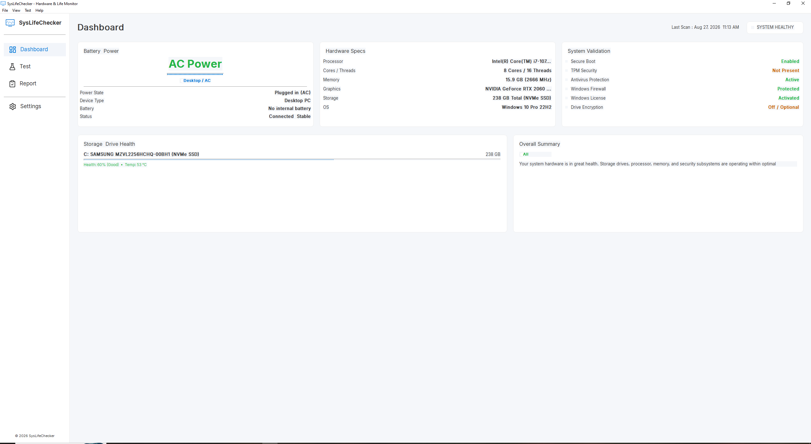
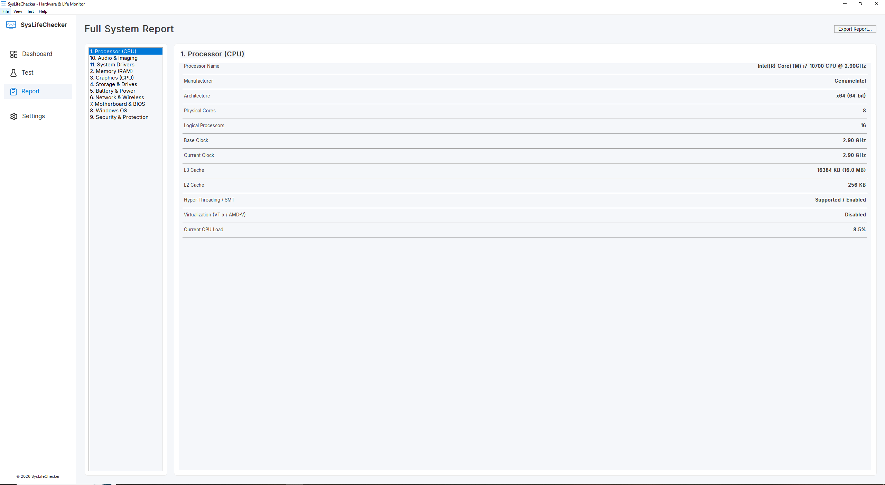

# SysLifeChecker — Free Windows PC Health Checker, Battery & SSD/HDD Life Monitor

**SysLifeChecker** is a free, open-source Windows desktop app that checks your computer's health in plain English — battery health, SSD/HDD lifespan and SMART status, RAM, CPU, GPU, storage, network, security, and more — all in one lightweight dashboard. Built for everyday PC users who want to know *"is my laptop battery dying?"* or *"is my SSD failing?"* without needing to be a technician, while still giving power users full SMART/WMI-level technical detail on demand.


---

## What is SysLifeChecker?

SysLifeChecker is a **free PC health check tool for Windows** that answers the questions most system-information apps make too complicated:

- 🔋 **How healthy is my laptop battery?** Design capacity vs. current full-charge capacity vs. how much charge is available right now, plus cycle count and a clear Healthy / Attention / Replace verdict.
- 💾 **Is my SSD or HDD dying?** Real SMART-attribute-based health scoring (NVMe wear level, reallocated sectors, pending sectors, uncorrectable errors) with an easy percentage and plain-language recommendation.
- 🧠 **What's actually in my PC?** CPU, RAM, GPU, motherboard, BIOS, storage, network adapters, audio, cameras, and drivers — all in one place.
- 🛡️ **Is my PC protected?** Secure Boot, TPM, Windows Defender, Firewall, BitLocker, and Windows activation status at a glance.
- 🧪 **Run built-in diagnostics** — CPU, RAM, storage I/O, power, and network checks with a live results log.

Unlike many Windows system information tools, SysLifeChecker is designed so that **non-technical users get instant, understandable answers**, while **technical users can drill into full SMART data, WMI details, and exportable reports** (HTML, JSON, and plain text).

---

## Key Features

- **Dashboard** — At-a-glance system health: battery, hardware specs, security validation, storage health, and an overall plain-language summary.
- **Full System Report** — Exhaustive, categorized technical detail (CPU, RAM, GPU, storage & SMART, battery, network, motherboard & BIOS, Windows, security, audio & imaging, drivers) with one-click export to **HTML**, **JSON**, or **plain text**.
- **Hardware Diagnostics** — On-demand CPU, RAM, storage, power, and network tests with a real-time log.
- **Battery Health Monitoring** — Design capacity, full-charge capacity, current charge, cycle count, and a health percentage, correctly reported as "no battery" on desktop PCs instead of a bogus number.
- **SSD & HDD Health / SMART Monitoring** — NVMe and SATA SMART data via `smartctl` (smartmontools), with a transparent, documented health-scoring formula.
- **Dark Mode** — A real, working light/dark theme toggle across the whole app.
- **Lightweight & Fast** — Native C++17 / wxWidgets desktop app, no Electron overhead, and zero background telemetry.

---

## Screenshots

| Dashboard View | Full Technical Report |
| :---: | :---: |
|  |  |

---

## Who is this for?

- Everyday laptop and desktop users who want a **simple battery health checker** or **SSD health checker for Windows** without confusing jargon.
- IT technicians and PC builders who need a **quick, exportable system report** for diagnostics or documentation.
- Anyone shopping for a **used laptop** who wants to verify battery wear and drive health before buying.

---

## Requirements

- **OS:** Windows 10 or Windows 11 (64-bit)
- **Framework:** [wxWidgets 3.2](https://www.wxwidgets.org/) (MSVC or MinGW/MSYS2 build)
- **Compiler:** C++17 compatible compiler (MSVC via Visual Studio, or MinGW-w64 via MSYS2)
- **Build Tool:** CMake 3.16+ (recommended) or `build_gui.bat`
- **Permissions:** Administrator privileges recommended for full low-level SMART/hardware diagnostics access.

---

## Building from Source

### Option 1: CMake (Recommended)

```bash
mkdir build && cd build
cmake ..
cmake --build . --config Release
```

This produces `SysLifeChecker.exe` — the GUI application.

### Option 2: MSYS2 / MinGW quick build

```bash
build_gui.bat
```

> **Note:** `build.bat` builds a separate, unrelated console diagnostic tool (`SysLifeChecker_ConsoleDevTool.exe`) used only for development/debugging — it is **not** the app itself. Run `SysLifeChecker.exe` (built by `build_gui.bat` or CMake) to use SysLifeChecker.

## Project Structure

```
SysLifeChecker/
├── include/        # Shared data-layer headers (SystemInfo.hpp, etc.)
├── src/            # Hardware data collectors (CPU, RAM, GPU, Storage, Battery, ...)
├── ui/             # wxWidgets GUI (Dashboard, Report, Settings, Test panels)
├── resources/      # Icons, logo, fonts
├── third_party/    # Bundled smartmontools (smartctl) for SMART/SSD health data
└── docs/           # Project documentation, including health-calculation internals
```

## Technical Documentation

For a full breakdown of exactly how battery health, SSD/HDD health, and other diagnostic scores are calculated — including the underlying Windows APIs, WMI classes, and SMART attributes used — see the technical internals PDF included in this repository (`docs/SysLifeChecker_Technical_Internals.pdf`).

## Frequently Asked Questions

**Does SysLifeChecker work on desktop PCs without a battery?**
Yes — it correctly detects the absence of a battery and shows AC power status instead of a fake battery percentage.

**Does it require an internet connection?**
No. All checks run locally using Windows APIs (WMI, Win32 device I/O) and the bundled `smartctl` tool. SysLifeChecker does not phone home or collect telemetry.

**Is SysLifeChecker free?**
Yes, SysLifeChecker is free and open source.

**Does it support NVMe SSDs?**
Yes — NVMe drives are read via `smartctl` and scored using the drive's own reported percentage-used/wear-level attribute.

## Contributing

Issues and pull requests are welcome. Please open an issue describing the hardware/OS configuration if you're reporting a detection bug, since most issues are model-specific WMI/SMART quirks.

## License & Credits

- **License**: GNU General Public License v3.0 (GPL-3.0). — see `LICENSE` for details.

- **Storage Engine**: Powered by [smartmontools](https://www.smartmontools.org/) `(smartctl)`

## Author

Developed by **Maaz Ali** ([@maazali04](https://github.com/maazali04)).
